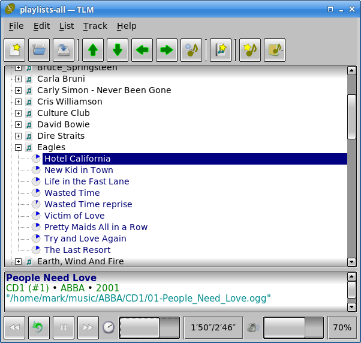

# MusicBox

An application to manage playlists and play tracks.

Tested on Linux and Windows.

`musicbox.exe` *is a precompiled Windows binary that should run on any
64-bit version of Windows* (MB; MD5 )

## Dependencies

Rust; see Cargo.toml for third-party crates.

## License

GPL-3.0.

## Other Free Software

[www.qtrac.eu](https://www.qtrac.eu/sitemap.html#foss).
